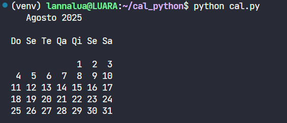
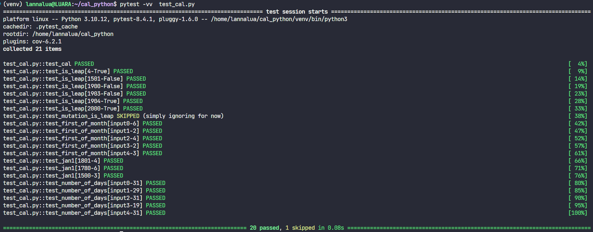
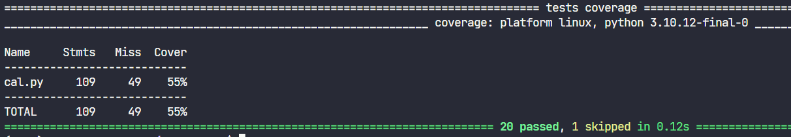
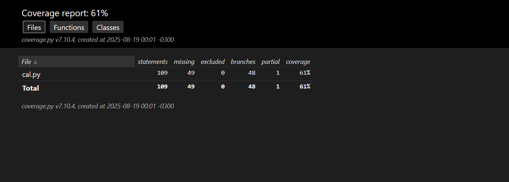
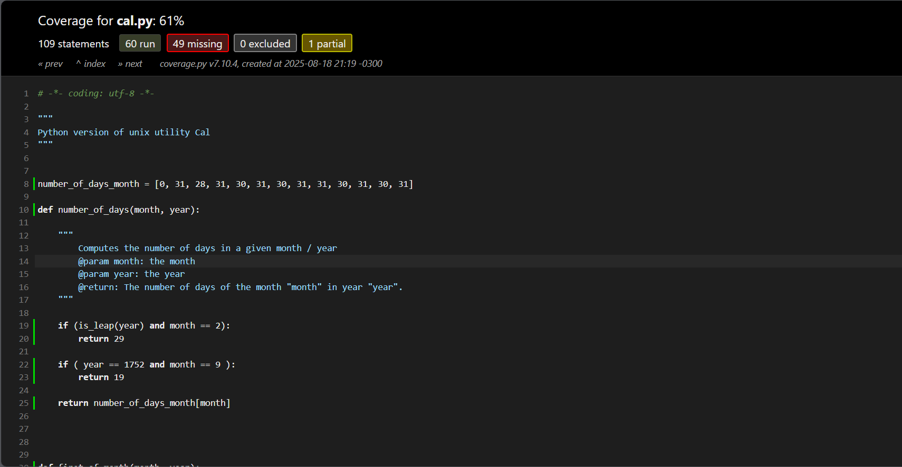
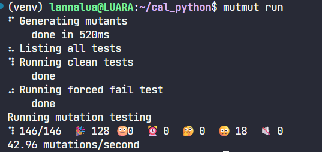
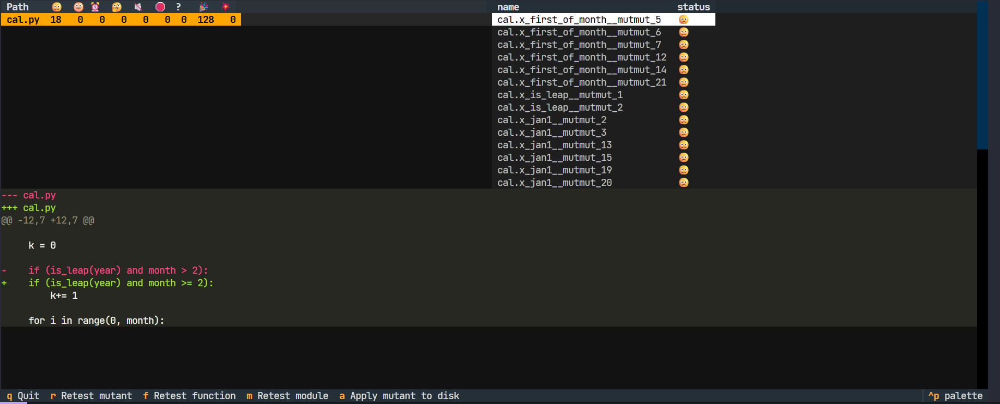
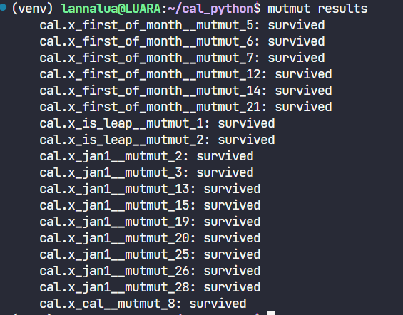
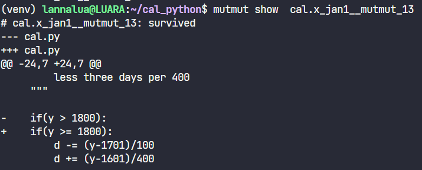

# Tutorial: Teste de mutação usando o Mutmut

Os detalhes do tutorial foram retirados do vídeo: [Link do vídeo](https://www.youtube.com/watch?v=FbMpoVOorFI) e utilizando exemplos presentes no repositório [cal_python](<https://github.com/stevaoaa/cal_python>).
Obs: a versão do Mutmut utilizada no vídeo está ultrapassada e uma versão mais recente foi utilizada (Mutmut, version 3.3.1). Alguns comandos utilizados no vídeo foram modificados ou removidos; seguindo a documentação do Mutmut precisar ser executado em sistemas com fork support, ou seja, sistemas UNIX.

## 1º passo: clonar o repositório na máquina local
```sh
git clone https://github.com/stevaoaa/cal_python
```

## 2º passo: Testar se o arquivo cal.py retorna o esperado


Testes sugeridos e realizados:
- python cal.py: retorna o calendário do mês atual
- python cal.py 2025: retorna o calendário do ano de 2025
- python cal.py 2 2004: retorna o calendário do mês de fevereiro de 2004

## 3º passo: Criação do ambiente virtual e instalação das dependências
Os detalhes desse passo estão no README do projeto base, mas os comandos necessários foram:
```sh
sudo apt install python3-venv	
cd cal_python
python -m venv venv
source venv/bin/activate
pip install -r requirements.txt
```
## 4º passo: Executar o pytest e exibir a execução dos casos de testes disponíveis
```sh
pytest -vv  test_cal.py
```


## 5º passo: Exibição dos relatórios de teste

```sh
pytest -vv  test_cal.py  --cov=cal
```


Também podemos ter o relatório em html, que pode ser encontrado em `htmlcov/index.html` após a execução do seguinte comando:
```sh
pytest -vv  test_cal.py  --cov=cal  --cov-branch  --cov-report html
```


Podemos ter também um relatório mais detalhado, encontrado em htmlcov/cal_py.html:
```sh
pytest -vv  test_cal.py  --cov=cal  --cov-branch  --cov-report html
```


## 6º passo: Execução de testes mutantes com Mutmut

Neste passo, iremos alterar algumas coisas do repositório original para seguir as especificações da versão mais recente do Mutmut. Primeiro vamos criar um arquivo setup.cfg e alterá-lo:
```sh
touch setup.cfg
nano setup.cfg
```
Dentro do arquivo, adicione as especificações dos arquivos que será testado com os mutantes:
```sh
[mutmut]
paths_to_mutate=cal.py
runner=pytest
tests_dir=.
```
Finalmente, para rodar o Mutmut faça
```sh
mutmut run
```


Para apresentar os detalhes das mutações e navegar entre elas, rode:
```sh
 mutmut browse
```


Para mais detalhes e lista de nomes das mutações que sobreviveram:
```sh
mutmut results
```

Para detalhes de uma única mutação realizada:
```sh
mutmut show <id_mutant>
```
